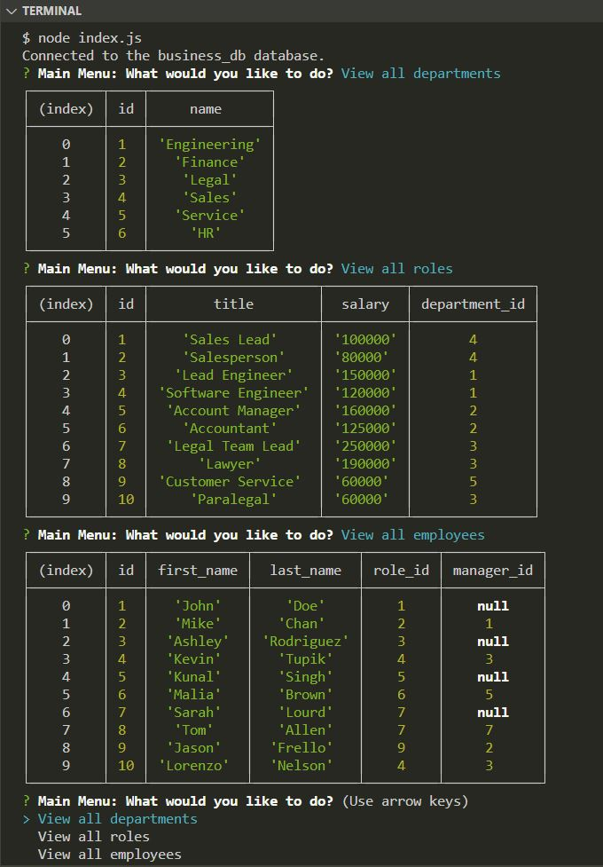

# Bird's Eye for Business
Easily view, change, and then view the changes for all individuals in your workplace in this handy bird's eye built for businesses

## Table of Contents

- [Description](#description)
- [Deployed Application](#deployed-application)
- [Future Improvements](#future-improvements)
- [Usage](#usage)
- [Credits](#credits)
- [License](#license)

## Description

This is a back-end application that allows a user to view or update a workplace's list of departments, all roles/job titles, and all existing employees. The app runs in node and is powered by inquirer, mysql2, dotenv, process, and console.table npm packages.

## Deployed Application

This challenge does not include a deployed application. Instead, a screen-recorded video is submitted alongside the github repo link.

Video link: https://drive.google.com/file/d/1i9vDdDTLYLmDfU2recQM0PSODGzLyGBb/view

## Future Improvements

 * Separate js files into a better file structure. I tried to separate them at first, but the functions I exported/required across files were not functioning properly. It was happier all together in one file in the end.
 * Use constructor functions or a class to better organize the SQL queries, as the assignment suggested, because I absolutely got lost in my own code.
 * Change the printed console tables to show department, role, and manager names instead of just their corresponding ids.
 * Change the printed console tables to show more column information, sometimes combined with other tables.
 * Make the department, role and employee lists dynamic within inquirer so that once one is added, the list next presented is the most recent list with the new additions.
 * Remove the (index) column from the printed data tables with console.table just to make it prettier.
 * Add the bonus features like more updates, deleting data, and sorting the column views 

## Usage

Below is a screenshot of Bird's Eye for Business.

## Credits

List of resources used:

https://www.educative.io/blog/what-is-database-query-sql-nosql

https://stackoverflow.com/questions/11448068/mysql-error-code-1175-during-update-in-mysql-workbench

https://www.sqlshack.com/learn-mysql-add-data-in-tables-using-the-insert-statement/

https://www.npmjs.com/package/process

https://www.npmjs.com/package/mysql2

https://www.npmjs.com/package/dotenv

https://www.npmjs.com/package/console.table

https://en.rakko.tools/tools/36/

https://kinsta.com/knowledgebase/content-management-system/

## License

No licenses (default copyright laws apply).

---